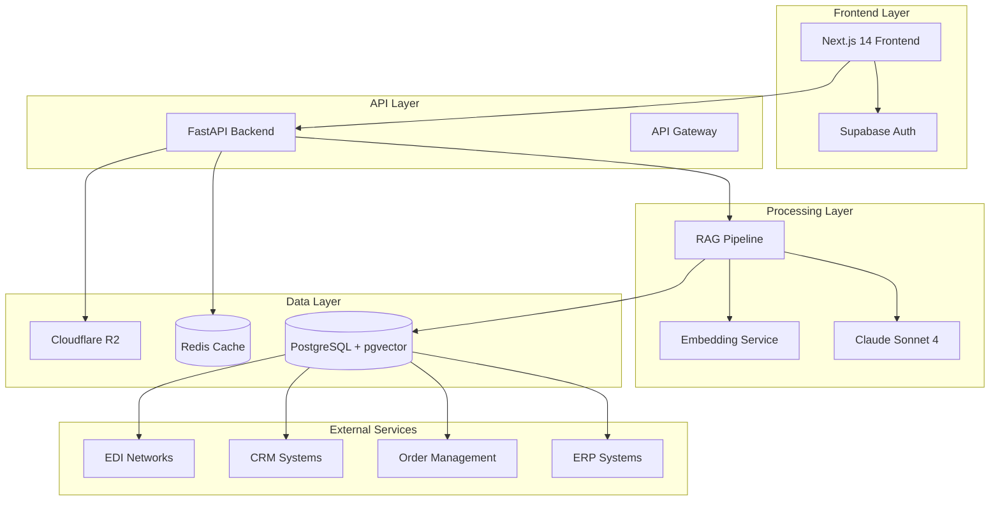
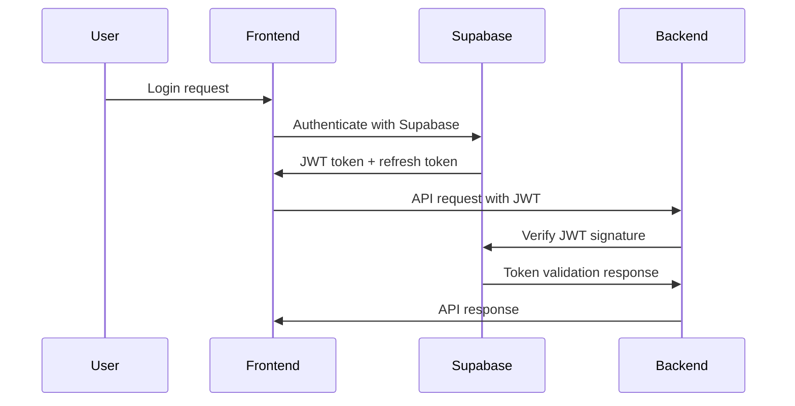

# DistroIQ System Architecture

This document describes the technical architecture, design decisions, and implementation details of the DistroIQ system.

## System Overview

DistroIQ is an AI-powered operations assistant that provides natural language querying capabilities over structured business data. The system employs a RAG (Retrieval-Augmented Generation) architecture to deliver accurate, contextual responses sourced from live inventory, order, customer, and supplier data.

## High-Level Architecture



## Component Architecture

### Frontend Layer

#### Next.js 14 Application
- **Framework**: App Router with Server Components
- **Language**: TypeScript with strict mode
- **Styling**: Tailwind CSS + shadcn/ui components
- **State Management**: Zustand for client state
- **Data Fetching**: React Query for server state

**Key Features:**
- Server-side rendering for performance
- Progressive Web App capabilities
- Real-time chat interface with streaming responses
- Responsive design for mobile and desktop

#### Authentication
- **Provider**: Supabase Auth
- **Flow**: JWT-based authentication with refresh tokens
- **Security**: Secure HTTP-only cookies, CSRF protection

### API Layer

#### FastAPI Backend
```python
app/
├── main.py                 # Application factory and middleware
├── api/v1/                # Versioned API routes
│   ├── auth.py            # Authentication endpoints
│   ├── chat.py            # Chat/query endpoints
│   ├── sources.py         # Data source management
│   └── files.py           # File upload endpoints
├── core/                  # Core business logic
│   ├── config.py          # Configuration management
│   ├── security.py        # JWT validation and security
│   ├── audit.py           # Audit logging system
│   ├── errors.py          # Error handling framework
│   ├── metrics.py         # Metrics and telemetry
│   └── diagnostics.py     # Health checks and debugging
├── models/                # Database models
├── schemas/               # Pydantic request/response models
└── rag/                   # RAG pipeline implementation
```

**Architecture Patterns:**
- **Dependency Injection**: FastAPI's DI system for database sessions
- **Repository Pattern**: Data access abstraction
- **Service Layer**: Business logic separation
- **CQRS**: Command/Query separation for complex operations

### Processing Layer

#### RAG Pipeline
```python
class RAGPipeline:
    def __init__(self):
        self.embedder = EmbeddingService()
        self.retriever = VectorRetriever()
        self.generator = ClaudeGenerator()
        
    async def process_query(self, query: str, user_context: UserContext):
        # 1. Query understanding and intent classification
        intent = await self.classify_intent(query)
        
        # 2. Embedding generation
        query_embedding = await self.embedder.embed(query)
        
        # 3. Vector similarity search
        relevant_docs = await self.retriever.search(
            query_embedding, 
            filters=user_context.access_filters
        )
        
        # 4. Context preparation
        context = self.prepare_context(relevant_docs, intent)
        
        # 5. LLM generation with streaming
        async for token in self.generator.stream_response(query, context):
            yield token
```

**Key Features:**
- **Intent Classification**: Determines query type (inventory, orders, etc.)
- **Access Control**: User-specific data filtering
- **Streaming Responses**: Real-time token delivery
- **Source Attribution**: Tracks data provenance

#### Embedding and Vector Search
- **Model**: OpenAI text-embedding-ada-002 or similar
- **Vector Database**: PostgreSQL with pgvector extension
- **Search Algorithm**: Cosine similarity with metadata filtering
- **Indexing**: HNSW indexes for fast approximate search

```sql
-- Example vector table structure
CREATE TABLE document_embeddings (
    id UUID PRIMARY KEY,
    content TEXT NOT NULL,
    embedding vector(1536),
    metadata JSONB,
    source_type VARCHAR(50),
    created_at TIMESTAMP DEFAULT NOW()
);

CREATE INDEX ON document_embeddings 
USING hnsw (embedding vector_cosine_ops);
```

### Data Layer

#### PostgreSQL Database
```sql
-- Core schema structure
CREATE SCHEMA core;
CREATE SCHEMA audit;
CREATE SCHEMA cache;

-- User and authentication
CREATE TABLE core.users (
    id UUID PRIMARY KEY DEFAULT gen_random_uuid(),
    email VARCHAR(255) UNIQUE NOT NULL,
    created_at TIMESTAMP DEFAULT NOW(),
    updated_at TIMESTAMP DEFAULT NOW()
);

-- Chat sessions and messages
CREATE TABLE core.chat_sessions (
    id UUID PRIMARY KEY DEFAULT gen_random_uuid(),
    user_id UUID REFERENCES core.users(id),
    title VARCHAR(500),
    created_at TIMESTAMP DEFAULT NOW()
);

CREATE TABLE core.messages (
    id UUID PRIMARY KEY DEFAULT gen_random_uuid(),
    session_id UUID REFERENCES core.chat_sessions(id),
    role VARCHAR(20) NOT NULL, -- 'user' or 'assistant'
    content TEXT NOT NULL,
    metadata JSONB,
    created_at TIMESTAMP DEFAULT NOW()
);

-- Data source connections
CREATE TABLE core.data_sources (
    id UUID PRIMARY KEY DEFAULT gen_random_uuid(),
    name VARCHAR(100) NOT NULL,
    type VARCHAR(50) NOT NULL, -- 'erp', 'oms', 'crm', 'edi'
    connection_config JSONB,
    status VARCHAR(20) DEFAULT 'active',
    last_sync TIMESTAMP,
    created_at TIMESTAMP DEFAULT NOW()
);

-- Document embeddings for RAG
CREATE TABLE core.document_embeddings (
    id UUID PRIMARY KEY DEFAULT gen_random_uuid(),
    source_id UUID REFERENCES core.data_sources(id),
    content TEXT NOT NULL,
    embedding vector(1536),
    metadata JSONB,
    chunk_index INTEGER,
    created_at TIMESTAMP DEFAULT NOW()
);

-- Audit trail
CREATE TABLE audit.events (
    id UUID PRIMARY KEY DEFAULT gen_random_uuid(),
    event_type VARCHAR(50) NOT NULL,
    user_id UUID,
    resource_type VARCHAR(50),
    resource_id VARCHAR(255),
    details JSONB,
    ip_address INET,
    user_agent TEXT,
    created_at TIMESTAMP DEFAULT NOW()
);
```

#### Redis Cache
```redis
# Cache structure patterns
user:sessions:{user_id} -> Set of active session IDs
user:permissions:{user_id} -> JSON object with permissions
query:cache:{hash} -> Cached query response
rate_limit:{user_id}:{endpoint} -> Rate limiting counters
```

**Caching Strategy:**
- **Query Results**: Cache frequent queries for 15 minutes
- **User Permissions**: Cache for 30 minutes, invalidate on change
- **Session Data**: Cache active sessions for performance
- **Rate Limiting**: Sliding window counters

### Security Architecture

#### Authentication Flow


#### Authorization Model
```python
class UserPermissions:
    def __init__(self, user_id: str, roles: List[str]):
        self.user_id = user_id
        self.roles = roles
        
    def can_access_source(self, source_type: str) -> bool:
        # Role-based access control
        role_permissions = {
            'admin': ['erp', 'oms', 'crm', 'edi'],
            'manager': ['oms', 'crm'],
            'employee': ['oms']
        }
        
        allowed_sources = set()
        for role in self.roles:
            allowed_sources.update(role_permissions.get(role, []))
            
        return source_type in allowed_sources
        
    def get_data_filters(self) -> Dict[str, Any]:
        # Row-level security filters
        if 'admin' in self.roles:
            return {}  # No restrictions
        elif 'manager' in self.roles:
            return {'region': self.get_user_region()}
        else:
            return {'department': self.get_user_department()}
```

#### Data Privacy and Compliance
- **Encryption at Rest**: Database-level encryption
- **Encryption in Transit**: TLS 1.3 for all communications
- **Data Minimization**: Only store necessary data
- **Right to be Forgotten**: Complete account deletion capability
- **Audit Logging**: All access logged for compliance

### Monitoring and Observability

#### Structured Logging
```python
import structlog

logger = structlog.get_logger()

# Example log entry
logger.info(
    "User query processed",
    user_id=user_id,
    query_type="inventory_lookup",
    response_time_ms=245,
    sources_queried=["erp", "warehouse"],
    results_count=15
)
```

#### Metrics Collection
```python
# Application metrics
from app.core.metrics import metrics, MetricCategory

# Track user actions
metrics.counter(
    "user_queries_total",
    category=MetricCategory.BUSINESS,
    tags={"query_type": "inventory", "success": "true"}
)

# Track performance
metrics.timing(
    "rag_pipeline_duration",
    category=MetricCategory.PERFORMANCE,
    duration_ms=response_time
)
```

#### Health Checks
```python
@router.get("/health")
async def health_check():
    checks = [
        await check_database_connection(),
        await check_redis_connection(),
        await check_external_services(),
        await check_rag_pipeline()
    ]
    
    overall_status = "healthy" if all(c.healthy for c in checks) else "degraded"
    
    return {
        "status": overall_status,
        "checks": [c.dict() for c in checks],
        "timestamp": datetime.utcnow().isoformat()
    }
```

## Design Decisions

### Technology Choices

#### Why FastAPI over Django/Flask?
- **Performance**: ASGI async support for high concurrency
- **Type Safety**: Native Pydantic integration for request/response validation
- **Documentation**: Automatic OpenAPI/Swagger generation
- **Modern**: Built-in support for async/await patterns

#### Why Next.js over React SPA?
- **SEO**: Server-side rendering for better search indexing
- **Performance**: Automatic code splitting and optimization
- **Developer Experience**: File-based routing and hot reloading
- **Production Ready**: Vercel integration for deployment

#### Why PostgreSQL + pgvector over dedicated vector DB?
- **Simplicity**: Single database for relational and vector data
- **ACID Compliance**: Transactional consistency for business data
- **Operational Overhead**: Fewer systems to manage and monitor
- **Cost**: Avoids additional vector database licensing

#### Why Supabase over Auth0/Cognito?
- **Integration**: PostgreSQL-native with RLS support
- **Features**: Complete auth solution with minimal setup
- **Cost**: Competitive pricing for startup/scale-up
- **Developer Experience**: Excellent documentation and tooling

### Architectural Patterns

#### Repository Pattern for Data Access
```python
class UserRepository:
    def __init__(self, db: AsyncSession):
        self.db = db
        
    async def create(self, user_data: UserCreate) -> User:
        user = User(**user_data.dict())
        self.db.add(user)
        await self.db.commit()
        await self.db.refresh(user)
        return user
        
    async def get_by_id(self, user_id: UUID) -> Optional[User]:
        result = await self.db.execute(
            select(User).where(User.id == user_id)
        )
        return result.scalar_one_or_none()
```

#### Service Layer for Business Logic
```python
class ChatService:
    def __init__(self, message_repo: MessageRepository, rag_pipeline: RAGPipeline):
        self.message_repo = message_repo
        self.rag_pipeline = rag_pipeline
        
    async def process_query(self, user_id: UUID, query: str) -> AsyncGenerator[str, None]:
        # Save user message
        await self.message_repo.create(
            session_id=session_id,
            role="user",
            content=query
        )
        
        # Process through RAG pipeline
        response_content = ""
        async for token in self.rag_pipeline.stream_response(query, user_context):
            response_content += token
            yield token
            
        # Save assistant response
        await self.message_repo.create(
            session_id=session_id,
            role="assistant", 
            content=response_content
        )
```

#### Event-Driven Architecture for Side Effects
```python
from app.core.events import event_bus

@event_bus.subscribe("user.account.deleted")
async def cleanup_user_data(event: UserDeletedEvent):
    # Clean up user sessions
    await session_service.delete_user_sessions(event.user_id)
    
    # Clean up cached data
    await cache.delete_pattern(f"user:{event.user_id}:*")
    
    # Log for audit
    audit_logger.info("User data cleanup completed", user_id=event.user_id)
```

## Performance Considerations

### Database Optimization

#### Connection Pooling
```python
# SQLAlchemy async engine configuration
engine = create_async_engine(
    DATABASE_URL,
    pool_size=20,  # Base number of connections
    max_overflow=30,  # Additional connections under load
    pool_timeout=30,  # Max wait time for connection
    pool_recycle=3600,  # Recycle connections every hour
    pool_pre_ping=True,  # Validate connections before use
    echo=False  # Disable SQL logging in production
)
```

#### Query Optimization
```python
# Use eager loading to avoid N+1 queries
async def get_chat_sessions_with_messages(user_id: UUID):
    result = await db.execute(
        select(ChatSession)
        .options(selectinload(ChatSession.messages))
        .where(ChatSession.user_id == user_id)
        .order_by(ChatSession.created_at.desc())
        .limit(50)
    )
    return result.scalars().all()

# Use pagination for large result sets
async def get_messages_paginated(session_id: UUID, page: int = 1, size: int = 50):
    offset = (page - 1) * size
    result = await db.execute(
        select(Message)
        .where(Message.session_id == session_id)
        .order_by(Message.created_at)
        .offset(offset)
        .limit(size)
    )
    return result.scalars().all()
```

### Caching Strategies

#### Application-Level Caching
```python
from functools import lru_cache
from app.core.cache import redis_cache

@lru_cache(maxsize=1000)
def get_user_permissions(user_id: str) -> UserPermissions:
    # Expensive permission calculation
    return calculate_permissions(user_id)

@redis_cache(expire=900)  # 15 minutes
async def get_cached_query_result(query_hash: str) -> Optional[QueryResult]:
    # Check Redis cache first
    cached = await redis.get(f"query:{query_hash}")
    if cached:
        return QueryResult.parse_raw(cached)
    return None
```

#### Response Caching
```python
# HTTP response caching with conditional requests
@router.get("/api/v1/sources", response_model=List[DataSource])
async def get_data_sources(
    if_none_match: Optional[str] = Header(None),
    db: AsyncSession = Depends(get_db)
):
    sources = await source_service.get_all(db)
    
    # Generate ETag based on content
    etag = hashlib.md5(json.dumps([s.dict() for s in sources]).encode()).hexdigest()
    
    # Return 304 if content hasn't changed
    if if_none_match == etag:
        return Response(status_code=304)
    
    return Response(
        content=json.dumps([s.dict() for s in sources]),
        headers={"ETag": etag, "Cache-Control": "max-age=300"}
    )
```

## Scalability Considerations

### Horizontal Scaling
- **Stateless Services**: All services designed to be stateless
- **Load Balancing**: Round-robin distribution across instances
- **Database Scaling**: Read replicas for query-heavy workloads
- **Cache Scaling**: Redis cluster for high-traffic scenarios

### Vertical Scaling
- **CPU Optimization**: Async/await patterns for I/O-bound operations
- **Memory Management**: Connection pooling and object lifecycle management
- **Storage Optimization**: Compressed embeddings and efficient indexing

### Auto-scaling Configuration
```yaml
# Render auto-scaling configuration
services:
  - name: distroiq-api
    runtime: python
    buildCommand: pip install -r requirements.txt
    startCommand: uvicorn app.main:app --host 0.0.0.0 --port $PORT
    scaling:
      minInstances: 2
      maxInstances: 10
      targetCPU: 70
      targetMemory: 80
```

## Security Considerations

### Threat Model
- **Data Exfiltration**: Unauthorized access to business data
- **Account Takeover**: Compromised user credentials
- **Injection Attacks**: SQL injection, prompt injection
- **DoS Attacks**: Resource exhaustion attacks

### Mitigation Strategies
- **Input Validation**: Strict Pydantic models for all inputs
- **SQL Injection**: Parameterized queries only, no string concatenation
- **Authentication**: Multi-factor authentication for admin accounts
- **Authorization**: Principle of least privilege
- **Rate Limiting**: Per-user and per-endpoint limits
- **Monitoring**: Real-time security event detection

### Compliance Requirements
- **GDPR**: Right to be forgotten (account deletion)
- **SOC 2**: Audit logging and access controls
- **Industry Standards**: Encryption, secure development practices

## Deployment Architecture

### Production Environment
```yaml
# Docker Compose equivalent for reference
version: '3.8'
services:
  frontend:
    image: distroiq/frontend
    ports:
      - "3000:3000"
    environment:
      - NEXT_PUBLIC_API_URL=https://api.distroiq.com
      
  backend:
    image: distroiq/backend
    ports:
      - "8000:8000"
    environment:
      - DATABASE_URL=${DATABASE_URL}
      - REDIS_URL=${REDIS_URL}
      - ANTHROPIC_API_KEY=${ANTHROPIC_API_KEY}
      
  postgres:
    image: pgvector/pgvector:pg15
    environment:
      - POSTGRES_DB=distroiq
      - POSTGRES_USER=${DB_USER}
      - POSTGRES_PASSWORD=${DB_PASSWORD}
    volumes:
      - postgres_data:/var/lib/postgresql/data
      
  redis:
    image: redis:7-alpine
    command: redis-server --appendonly yes
    volumes:
      - redis_data:/data
```

### Infrastructure as Code
```terraform
# Example Terraform configuration
resource "aws_ecs_cluster" "distroiq" {
  name = "distroiq-production"
}

resource "aws_ecs_service" "backend" {
  name            = "distroiq-backend"
  cluster         = aws_ecs_cluster.distroiq.id
  task_definition = aws_ecs_task_definition.backend.arn
  desired_count   = 3
  
  load_balancer {
    target_group_arn = aws_lb_target_group.backend.arn
    container_name   = "distroiq-backend"
    container_port   = 8000
  }
  
  deployment_configuration {
    maximum_percent         = 200
    minimum_healthy_percent = 100
  }
}
```

---

This architecture documentation provides the foundation for understanding, maintaining, and evolving the DistroIQ system. For implementation details and operational procedures, refer to the other documentation in this repository.